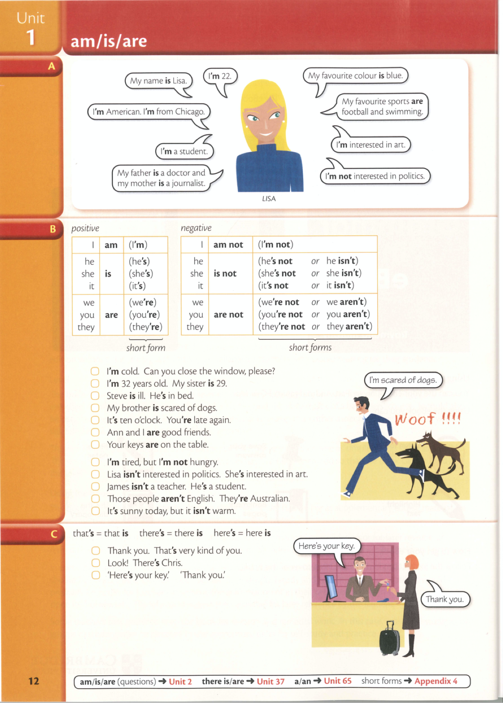
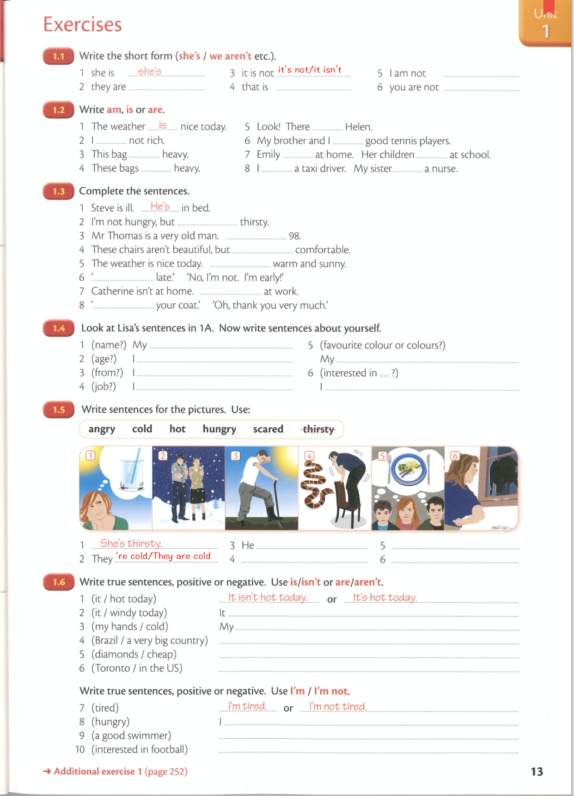

# am/is/are

## video tutorial

<iframe src="//player.bilibili.com/player.html?aid=61143002&bvid=BV1tt411w72A&cid=106379110&page=3" scrolling="no" frameborder="no" framespacing="0" allowfullscreen="true" height=500 width=100% ></iframe>

## text book

## exercise

## exercise answers




